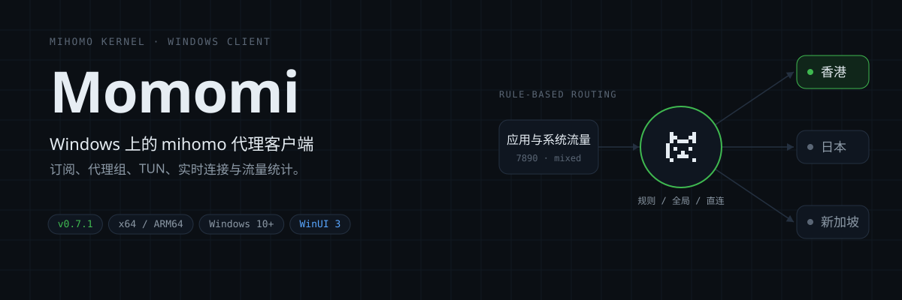

<div align="center">


# Momomi

**基于 mihomo 内核的 Windows 代理客户端**

订阅、代理组、TUN、实时连接与流量统计，都收在一块面板里。

[](https://github.com/iwvw/Momomi/releases/latest)
[](https://github.com/iwvw/Momomi/releases)
[](#运行要求)
[](https://dotnet.microsoft.com/)
[](https://learn.microsoft.com/windows/apps/winui/winui3/)



</div>

## 这是什么

Momomi 是一个原生 Windows 桌面应用，用 [mihomo](https://github.com/MetaCubeX/mihomo)（Clash.Meta）作为代理内核。它把内核、订阅、系统代理和图形界面打包成一个开箱即用的客户端：导入订阅后点一下就能联网，日常需要的节点切换、连接排查、流量查看都在同一个窗口里完成。

界面使用 WinUI 3，跟随系统深浅色与亚克力 / Mica 背景；托盘和迷你面板让它在后台也能随手操作。

## 功能

| 能力 | 说明 |
|---|---|
| 三种代理模式 | 规则 / 全局 / 直连，运行中即时切换，无需重启 |
| 系统代理 | 写系统代理设置并即时通知刷新，支持手动代理与 PAC 两种模式 |
| TUN 模式 | 接管全局流量，支持 stack、自动路由、严格路由、MTU、DNS 劫持等参数 |
| 订阅管理 | URL / 本地文件导入、编辑、刷新，解析流量用量与到期时间，每小时自动更新 |
| 代理组与节点 | 选择器 / 自动测速 / 故障转移等组类型，单点或整组测速，记住手动选择 |
| 实时连接 | 每条连接的进程图标、规则、代理链、上下行速率，支持过滤、排序与关闭 |
| 流量统计 | 实时速率、累计流量、内核内存与连接数，6 小时至 30 天的历史趋势 |
| 规则查看 | 展示运行态规则与命中次数，可临时禁用单条规则或一键恢复 |
| 实时日志 | 内核日志流，按级别过滤、暂停、复制与清空 |
| 网络诊断 | 出口 IP 与归属地识别（含国旗）、常用目标延迟测试 |
| 全局快捷键 | 显示主界面、切换系统代理 / TUN / 模式等，支持冲突检测 |
| 托盘与迷你面板 | 托盘状态变色与 Fluent 菜单；迷你面板显示速率、模式与订阅用量 |
| SSID 感知 | 按 WiFi 自动暂停代理或切换订阅 |
| 内核与应用更新 | 内核、地理数据、应用本体均可检查更新并一键升级 |

## 安装

到 [Releases](https://github.com/iwvw/Momomi/releases/latest) 下载最新版。提供合并版与分离版两种形态：

**合并版（自包含，推荐）** — 自带 .NET 与 WinUI 运行时，解压即用。

| 类型 | 说明 |
|---|---|
| x64 安装包 | **推荐**。一键安装，可选开机自启与桌面快捷方式 |
| x64 便携版 | 解压即用，无需安装 |
| x64 完整版 安装包 | 内置内核与地理数据库，开箱即用 |
| x64 完整版 便携包 | 内置内核与地理数据库，解压即用 |
| ARM64 便携版 | ARM64 设备（如骁龙本） |
| ARM64 完整版 便携包 | ARM64 设备，内置内核与地理数据库 |

**分离版（框架依赖，体积最小）** — 需系统已装 .NET 10 桌面运行时与 Windows App Runtime 2.x，否则无法启动。仅提供 x64，体积比合并版小约 100 MB。

| 类型 | 说明 |
|---|---|
| x64 安装包 | 一键安装，安装时检测运行时并提示 |
| x64 便携版 | 解压即用，需自备运行时 |
| x64 完整版 安装包 / 便携包 | 内置内核与地理数据库，需自备运行时 |

精简版体积更小，首次启动会联网下载内核与地理数据；完整版内置内核与地理数据，适合网络访问 GitHub 不便的场景。绝大多数 Windows 电脑选 **x64 合并版**。

## 快速上手

1. 启动 Momomi（首次会请求管理员权限，用于 TUN）。
2. 进入 **订阅** 页，粘贴订阅链接导入，导入后立即生效。
3. 回到 **概览**，在 **代理** 页选择一个节点或代理组。
4. 需要全局接管时打开 **TUN**，否则打开 **系统代理** 即可。

关闭主窗口默认最小化到托盘，左键单击托盘图标呼出迷你面板。

## 运行要求

- **Windows 10 1809（17763）及以上**，支持 x64 与 ARM64。
- **管理员权限**：主程序以管理员运行，内核作为子进程继承权限，TUN 才能直接生效。若 UAC 设置为不通知，提权会失败并回退到普通代理模式。
- **分离版额外要求**：需系统已安装 [.NET 10 桌面运行时](https://dotnet.microsoft.com/download/dotnet/10.0) 与 [Windows App Runtime 2.x](https://aka.ms/windowsappsdk/2.4/latest/windowsappruntimeinstall-x64.exe)。合并版无需这些。
- TUN 依赖 **wintun**，会在需要时自动下载。
- 默认混合端口 **7890**、控制端口 **9090**。若端口被 clash-party 等程序占用，请在设置中修改混合端口。

## 数据与目录

用户数据（数据库、订阅、内核、地理数据）优先存放在程序目录下的 `data\`，便于便携使用与整体迁移；若程序目录不可写，则回退到 `%LOCALAPPDATA%\Momomi`，并可从旧目录自动迁移。也可用环境变量 `MOMOMI_DATA_DIR` 指定。

```
data\
├── momomi.db          # SQLite：设置、订阅、流量与连接历史
├── core\              # mihomo 内核、wintun、地理数据、runtime.yaml
└── profiles\          # 订阅原始配置
```

安装与便携版更新都会跳过 `data\`，升级不会影响你的订阅与配置。

## 架构

```
Momomi.App        WinUI 3 主程序：界面、托盘、迷你面板、快捷键、生命周期
Momomi.Core       业务核心：进程与配置、订阅、系统代理、更新、SSID、PAC
Momomi.Data       SQLite 数据层：设置、订阅、流量、连接历史
Momomi.Elevated   提权宿主：以管理员身份代为启动 / 停止内核（TUN 用）
```

应用启动后由 `Momomi.Core` 生成 `runtime.yaml`（在订阅原始配置上叠加端口、模式、DNS、TUN 等全局项），交给 mihomo 内核运行，再通过其 RESTful API（默认 `127.0.0.1:9090`）读取代理组、连接、流量与日志。

## 构建

需要 .NET 10 SDK 与 Windows App SDK 工具链。

```powershell
# 恢复与构建
dotnet build Momomi.slnx -c Debug -p:Platform=x64

# 合并版（自包含，自带运行时）
dotnet publish src/Momomi.App/Momomi.App.csproj `
  -c Release -r win-x64 -p:SelfContained=true -p:WindowsAppSDKSelfContained=true `
  -p:Platform=x64 -o publish

# 分离版（框架依赖，体积最小）
dotnet publish src/Momomi.App/Momomi.App.csproj `
  -c Release -r win-x64 -p:SelfContained=false -p:WindowsAppSDKSelfContained=false `
  -p:Platform=x64 -o publish
```

推 `v*` 标签会触发 [Release workflow](.github/workflows/release.yml)，自动构建合并版（x64 / ARM64 × 精简 / 完整）与分离版（x64 × 精简 / 完整），并生成安装包与便携包。

## 注意事项

- 安装包未做代码签名，Windows SmartScreen 可能提示未知发布者，选择「仍要运行」即可。
- 请遵守当地法律法规，仅将本软件用于合法用途。

## 致谢与许可

本项目构建在这些开源项目之上：

| 项目 | 用途 | 许可证 |
|---|---|---|
| [MetaCubeX/mihomo](https://github.com/MetaCubeX/mihomo) | 代理内核（Clash.Meta） | MIT |
| [MetaCubeX/meta-rules-dat](https://github.com/MetaCubeX/meta-rules-dat) | 地理数据库（geoip / geosite / ASN） | GPL-3.0 |
| [WireGuard/wintun](https://www.wintun.net/) | TUN 模式的虚拟网卡驱动 | GPL-2.0 |
| [lipis/flag-icons](https://github.com/lipis/flag-icons) | 出口 IP 归属地的 SVG 国旗 | MIT |
| [HavenDV/H.NotifyIcon](https://github.com/HavenDV/H.NotifyIcon) | 托盘图标与右键菜单 | MIT |
| [CommunityToolkit/dotnet](https://github.com/CommunityToolkit/dotnet) | MVVM 框架（CommunityToolkit.Mvvm） | MIT |
| [CommunityToolkit/Windows](https://github.com/CommunityToolkit/Windows) | WinUI 控件（SettingsControls 等） | MIT |
| [aaubry/YamlDotNet](https://github.com/aaubry/YamlDotNet) | runtime.yaml 的读写 | MIT |
| [dotnet/efcore](https://github.com/dotnet/efcore) | SQLite 访问（Microsoft.Data.Sqlite） | MIT |
| [Microsoft Windows App SDK](https://github.com/microsoft/WindowsAppSDK) | WinUI 3 应用框架 | MIT |
| [.NET](https://github.com/dotnet/runtime) | 运行时与基础库 | MIT |
| [jrsoftware/issrc](https://github.com/jrsoftware/issrc) | 安装包（Inno Setup，构建期） | 自定义许可 |

像素猫图标基于 MIT 许可的图标修改，详见 [`ICONS-LICENSE.md`](src/Momomi.App/Assets/ICONS-LICENSE.md)。

